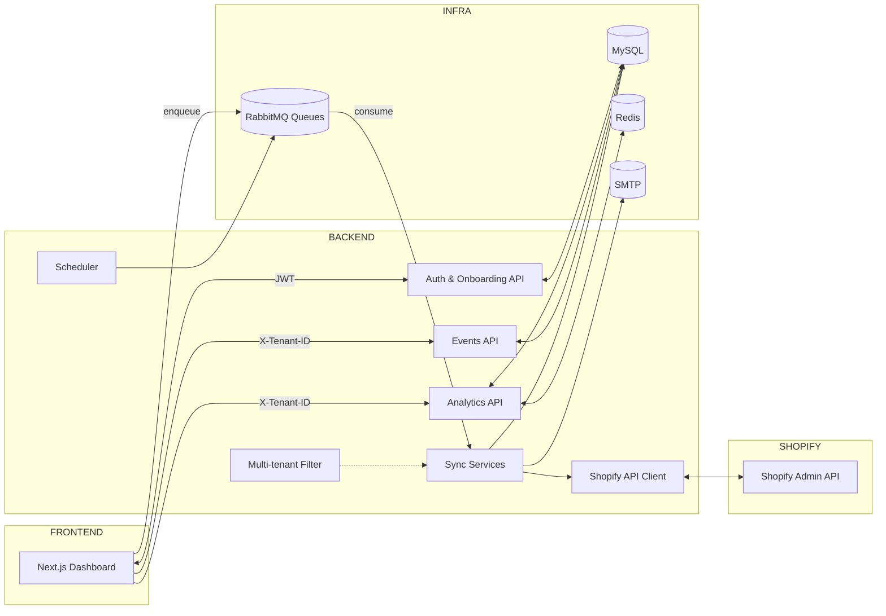

# Xeno – Multi‑Tenant Shopify Data Ingestion & Insights

This document explains the solution you’re looking at: a production‑leaning, multi‑tenant service that onboards Shopify stores, ingests their data, and serves analytics to a simple dashboard.

- Backend: Spring Boot 3 (Java 21), JPA/Hibernate, MySQL, Redis Cache, RabbitMQ, Mail
- Frontend: Next.js App Router (React 19), Recharts
- Multi‑tenancy: row‑level isolation via a tenant identifier (X‑Tenant‑ID)
- Sync: scheduler + queue (RabbitMQ) + Shopify REST Admin API (cursor pagination)

## What you can do with it

- Register/login (JWT), and onboard one or more Shopify stores (tenants)
- Store Shopify Admin API token securely (encrypted at rest)
- Run full or incremental syncs of Customers, Products/Variants, and Orders
- View KPIs and charts: total revenue, daily revenue, order status breakdown, top customers, stockouts, AOV, UPT, cancellation rate, top products, new vs returning

## High‑level architecture (Mermaid)

## Multi‑tenancy model

- Isolation is row‑level: every business table has a Tenant FK (`tenant_id`).
- A lightweight request filter (`MultiTenantFilter`) captures the tenant from request headers and exposes it via `TenantContext` (ThreadLocal) for service layer usage.
- The frontend always sets `X-Tenant-ID: {tenantId}` for tenant‑scoped APIs. Access is enforced: controllers consult `UserTenantAccessService` to verify a user’s role for the tenant.

## Data model (overview)

Key entities (JPA):

- Tenant: `tenant_id`, `shop_domain` (unique), `shop_name`, encrypted `access_token`, metadata, `is_active`
- User: local auth user; BCrypted password; `is_active`
- UserTenantAccess: join table (User ↔ Tenant) with `role` (admin, viewer, …)
- Customer, CustomerAddress, CustomerEvent
- Product, ProductVariant
- Order, OrderLineItem
- SyncLog: tracks each sync segment (type, status, counts, errors)

Notes:
- All core tables include `tenant_id` and indices optimized for lookups like `findByTenantTenantIdAndShopify…`.
- CustomerEvent captures custom events (e.g., cart_abandoned) and associates optionally with customers.

## APIs (contract summary)

Authentication (public):
- POST `/api/auth/register` → { accessToken, id, email, … }
- POST `/api/auth/login` → { accessToken, id, email, … }

Tenant onboarding & access (JWT required):
- POST `/api/tenant-access/onboard` body: { shopDomain, accessToken }
- GET `/api/tenant-access/my-tenants`
- GET `/api/tenant-access/tenant/{tenantId}`
- PUT `/api/tenant-access/tenant/{tenantId}/role` body: { role }
- DELETE `/api/tenant-access/tenant/{tenantId}` (remove current user’s access)
- GET `/api/tenant-access/tenant/{tenantId}/users`
- GET `/api/tenant-access/tenant/{tenantId}/stats`
- GET `/api/tenant-access/my-tenant-stats`

Tenant lifecycle (admin endpoints):
- POST `/api/tenants/onboard` body: { shopDomain, accessToken } → creates/updates tenant
- GET `/api/tenants/{tenantId}`
- DELETE `/api/tenants/{tenantId}` → deboard/delete tenant

Sync (JWT required):
- POST `/api/sync/full` header: `X-Tenant-ID` → enqueue immediate full sync (runs synchronously via service)
- POST `/api/sync/incremental?since=ISO8601` header: `X-Tenant-ID`
- POST `/api/sync/full/all` → iterate all active tenants
- POST `/api/sync/incremental/all?since=ISO8601`

Sync jobs (RabbitMQ; enqueue):
- POST `/api/sync/jobs` body: { type: FULL|INCREMENTAL, tenantId: string|ALL, since?: ISO8601 }
- POST `/api/sync/jobs/single/{tenantId}?type=…&since=…`

Analytics (JWT required; tenant‑scoped with `X-Tenant-ID`):
- GET `/api/analytics/revenue?start=ISO&end=ISO` → { totalRevenue }
- GET `/api/analytics/revenue/daily?start=YYYY-MM-DD&end=YYYY-MM-DD` → [{ date, revenue }]
- GET `/api/analytics/orders/status-breakdown` → breakdown list
- GET `/api/analytics/customers/top?limit=N` → top spenders
- GET `/api/analytics/customers/stockout?limit=N` → low/stockout variants
- GET `/api/analytics/aov?start=ISO&end=ISO` → { aov, orders, revenue, discounts }
- GET `/api/analytics/upt?start=ISO&end=ISO` → { upt, units, orders }
- GET `/api/analytics/products/top?by=revenue|quantity&limit=N&start=ISO&end=ISO`
- GET `/api/analytics/customers/new-vs-returning?start=ISO&end=ISO` → { new, returning }
- GET `/api/analytics/orders/cancellation-rate?start=ISO&end=ISO` → { cancelled, total, rate }

Events (JWT required; tenant‑scoped):
- POST `/api/events` header: `X-Tenant-ID`, body: { customerId?, eventType, data?, sessionId?, ip?, userAgent? }

Conventions:
- Auth: Bearer JWT in `Authorization: Bearer <token>`
- Tenant scoping: `X-Tenant-ID: <tenantId>`
- Time range params use ISO‑8601 (DateTime or Date as specified)

## Sync strategy & Shopify integration

- Sync orchestration happens in `SyncService`:
	- Full sync: customers → products (+variants) → orders
	- Incremental sync: same order, filtered by `updated_at` (service methods like `sync…UpdatedSince`)
- Cursor pagination: `ShopifyApiService` implements `getCursorPage` and `iterateAll` using Shopify’s Link header and `page_info` cursors.
- Retries & backoff: on HTTP errors, bounded retry with exponential backoff; 429 rate limit headers are logged.
- Scheduling & queuing:
	- `SyncJobScheduler` (Spring @Scheduled) enqueues FULL/INCREMENTAL jobs on a cron (default: every 30 minutes).
	- `TenantQueueProvider` declares per‑tenant durable queues with DLX/DLQ.
	- `SyncJobListener` consumes jobs and invokes `SyncService`.
- Observability of runs: `SyncLog` rows track status, counts, and errors. `NotificationService` can email on failures.

Webhooks (next step): Tenant has `webhookSecret` reserved; you can add Shopify webhooks for near‑real‑time updates and push into the same queues.

## Frontend UX overview

- Auth pages: register/login
- Tenants page: list user’s stores, connect new store (validates Shopify token against `/admin/api/2024-10/shop.json` before onboarding), delete store
- Tenant details: shows metrics, charts, and lists, powered by analytics endpoints (always passing `X-Tenant-ID`)
- Middleware guards: protects `/tenants`, `/analytics`, etc., using the `auth_token` cookie

## Setup & running

Prerequisites:
- Java 21, Node.js 20+, a MySQL instance, Redis, and optionally RabbitMQ and SMTP

Environment variables (backend):
- Database: `MYSQLUSER`, `MYSQLPASSWORD`, `spring.datasource.url` (override default Railway URL for local)
- JWT: `JWT_SECRET`
- Token crypto: `TOKEN_CRYPTO_KEY` (used to encrypt Shopify access tokens; format stored is `iv:ct` Base64)
- Redis: `REDISHOST`, `REDISPORT`, `REDIS_PASSWORD` or `spring.data.redis.url`
- RabbitMQ (optional for local): `RABBITMQ_URL`; or disable messaging with `sync.messaging.enabled=false`
- Mail (optional): `MAIL_USERNAME`, `MAIL_PASSWORD`

Local DB schema: The code ships with `spring.jpa.hibernate.ddl-auto=none`. For a local spin‑up, either pre‑create tables or temporarily set an environment override to let Hibernate create/update schemas:

- `SPRING_JPA_HIBERNATE_DDL_AUTO=update`

Run backend (from `xenoBackend/`):
- Build & run: `./gradlew bootRun`
- Base URL: `http://localhost:8080/api`

Frontend env:
- `NEXT_PUBLIC_API_BASE_URL` must point to backend `/api`, e.g. `http://localhost:8080/api`

Run frontend (from `XenoTaskFrontend/`):
- `npm install`
- `npm run dev`
- App: `http://localhost:3000`

Deployment (example):
- Backend on Railway (MySQL/RabbitMQ private network friendly) or Render/Railway; set env vars accordingly
- Frontend on Vercel; set `NEXT_PUBLIC_API_BASE_URL` to your public backend `/api` URL

## Security & auth

- Stateless JWT auth with Spring Security; endpoints require Bearer token except `/api/auth/*`
- Shopify Admin API tokens are encrypted at rest using `CryptoService` and a symmetric key (`TOKEN_CRYPTO_KEY`)
- Tenant access control is enforced per request via `UserTenantAccessService`

## Caching & performance

- Redis cache with short TTLs (default 5 minutes; custom TTLs per metric type)
- Cursor pagination and per‑tenant queues help throttle and isolate sync load
- Read patterns are indexed (unique constraints on Shopify IDs + tenant)

## Assumptions

- Each tenant corresponds to a single Shopify shop domain
- Shopify Admin API access token is provided directly for this assignment (no OAuth app install flow)
- Row‑level multi‑tenancy is sufficient for the expected data volumes; a single logical schema is used
- Sync is idempotent at the upsert layer; Shopify IDs are the source of truth per tenant

## Known limitations

- No OAuth app install flow; onboarding requires manual Admin API token copy‑paste
- Webhooks are not wired yet; scheduler + manual enqueue drive sync
- No schema migrations tool included; use `ddl-auto=update` or add Flyway/Liquibase
- Limited error dashboards; errors are logged and emailed, but not surfaced in UI

## Next steps to productionize

- Shopify OAuth app + token refresh, rotate secrets, store metadata (scopes)
- Webhooks for near‑real‑time updates (orders/create, customers/update, products/update, carts)
- Migrations: Flyway or Liquibase with repeatable/Versioned scripts
- Observability: tracing, metrics, structured logs, alerting; expose `/actuator` and dashboards
- Hardening: request validation, rate limiting, WAF/CDN, per‑tenant quotas, SLOs
- Data: historical backfills, partial replays, DLQ reprocessing UI, idempotency keys
- Scale: horizontalize consumers, partition queues, read replicas, archiving, table partitioning
- RBAC: roles beyond admin/viewer, audit logs, org/team structure

## Quick reference: request patterns

Headers
- `Authorization: Bearer <JWT>` (most endpoints)
- `X-Tenant-ID: <tenantId>` (tenant analytics & events; not required for onboarding)

Examples
- Login: POST `/api/auth/login` { email, password }
- Onboard tenant: POST `/api/tenant-access/onboard` { shopDomain, accessToken }
- Start full sync (tenant): POST `/api/sync/full` + `X-Tenant-ID`
- Daily revenue: GET `/api/analytics/revenue/daily?start=YYYY-MM-DD&end=YYYY-MM-DD` + `X-Tenant-ID`

